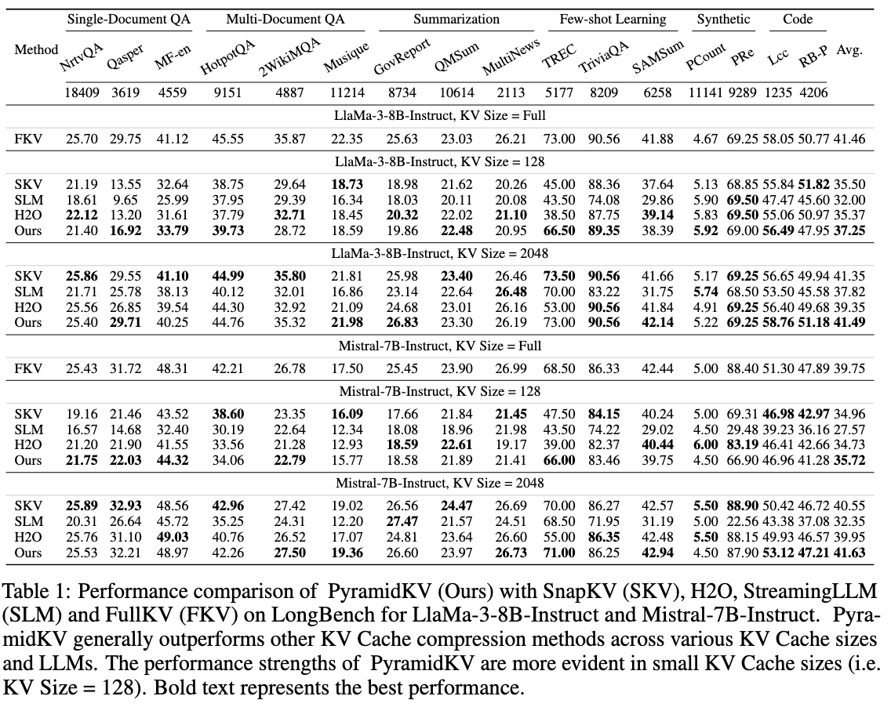
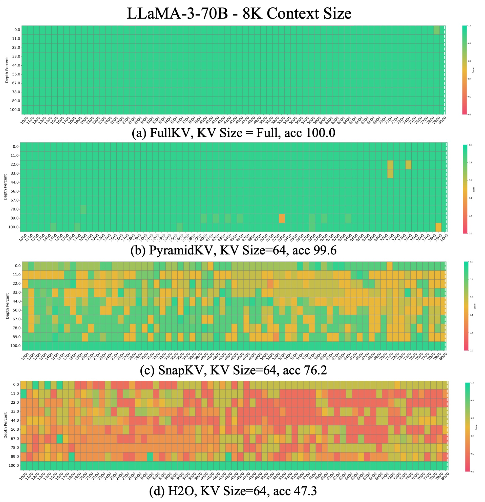
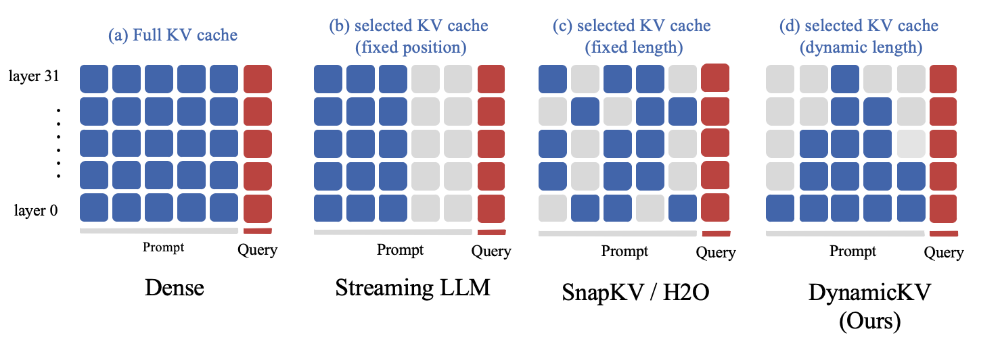
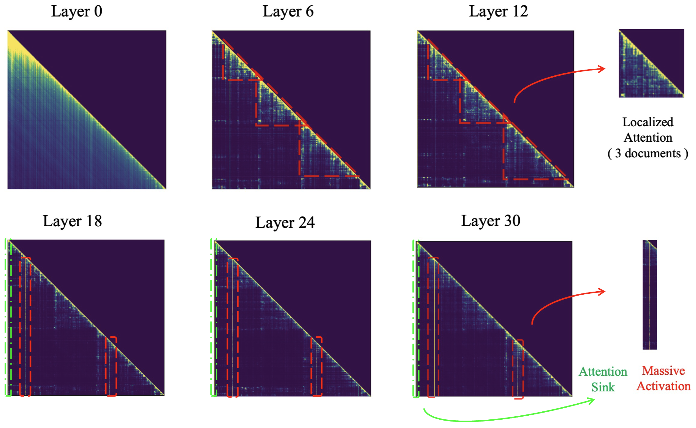

<p align="center">
  
</p>

# KVCache-Factory

KVCache-Factory is a unified playground for KV cache compression, retrieval, merging, and quantization methods for long-context LLM inference. It started from PyramidKV and now includes multiple KV cache baselines under one evaluation interface.

## News

- **2024-11-28**: Renamed the project to **KVCache-Factory** to reflect the broader goal of supporting diverse KV cache compression methods.
- **2024-06-25**: Added multi-GPU inference support for large LLMs, including Llama-3-70B-Instruct.
- **2024-06-10**: Added FlashAttention v2 and SDPA paths for PyramidKV, SnapKV, H2O, and StreamingLLM. On GPUs without FlashAttention v2 support, set `--attn_implementation sdpa`.

## Supported Methods

| Method | Type | Notes |
| --- | --- | --- |
| `FullKV` | Baseline | Keeps the full KV cache. |
| `StreamingLLM` | Compression/eviction | Attention-sink plus sliding-window cache. |
| `H2O` | Retrieval/compression | Heavy-hitter token retention. |
| `SnapKV` | Retrieval/compression | Observation-window attention pooling. |
| `Quest` | Query-aware retrieval | Page-level key min/max metadata and query-aware page/token selection. |
| `NACL` | Encoding-time eviction | Proxy-token score reduction with optional random eviction. |
| `Scissorhands` | Persistence-based eviction | Historical importance accumulation with fixed-budget pivotal-token selection. |
| `MiniCache` | Cross-layer compression | Adjacent-layer SLERP direction sharing with magnitude restore and token retention. |
| `PyramidKV` | Compression/budget allocation | Layer-wise pyramidal cache budget. |
| `CAM` | Merge/compression | Cache merging with attention-informed value aggregation. |
| `L2Norm` | Retrieval/compression | Norm-based token selection. |
| `AdaKV` | Adaptive compression | Head-adaptive KV cache budgets. |
| `HeadKV` | Adaptive retrieval/compression | Head-aware retrieval/reasoning cache allocation. |
| `ThinK` | Key-cache pruning | Query-driven key-channel pruning for Llama LongBench runs. |
| `MInference` | Sparse prefill acceleration | Optional integration through the MInference dependency. |
| `KIVI` / `KVQuant` / `GEAR` | Quantization | Enabled with `--quant_method kivi`, `--quant_method kvquant`, or `--quant_method gear`. GEAR additionally accepts `--rank` and `--outlier_ratio`. |

Llama and Mistral attention paths are supported for the main compression methods. Some newer methods currently have narrower runner/model coverage; check the runner argument choices before launching large jobs.

## Results

<p align="center">
  <br>
  <sub>LongBench performance comparison.</sub>
</p>

<p align="center">
  <br>
  <sub>Needle-in-a-haystack retrieval results.</sub>
</p>

## PyramidKV Overview

<p align="center">
  
</p>

## Visualization: Inefficient Attention

The following attention map shows a Llama model attending over a prompt with three documents.

<p align="center">
  
</p>

Use `examples/visualization.ipynb` and the utilities under `pyramidkv/viztools/` to reproduce or customize attention visualizations. Generated attention maps are stored under `./attention` by default.

## Requirements

```text
transformers==4.44.2
torch
flash-attn>=2.4.0.post1
```

Install the complete dependency set with `requirements.txt`. `flash-attn` is optional when using `--attn_implementation sdpa` or `eager`, but required for FlashAttention v2 experiments.

## Installation

```bash
git clone https://github.com/Zefan-Cai/KVCache-Factory.git
cd KVCache-Factory
pip install -r requirements.txt
export PYTHONPATH="$PWD:${PYTHONPATH}"
```

## LongBench

Edit `scripts/scripts_longBench/eval.sh` or call `run_longbench.py` directly:

```bash
export CUDA_VISIBLE_DEVICES=0

python3 run_longbench.py \
  --method pyramidkv \
  --model_path /path/to/Llama-3-8B-Instruct \
  --max_capacity_prompts 512 \
  --attn_implementation flash_attention_2 \
  --save_dir ./results_long_bench \
  --use_cache True
```

Common arguments:

- `--method`: `FullKV`, `pyramidkv`, `snapkv`, `streamingllm`, `h2o`, `cam`, `l2norm`, `adakv`, `headkv`, `think`, or `minference`.
- `--model_path`: local or Hugging Face model path.
- `--attn_implementation`: `flash_attention_2`, `sdpa`, or `eager`.
- `--max_capacity_prompts`: target KV cache budget per layer. PyramidKV redistributes the total budget across layers.
- `--merge`: optional merge strategy, `pivot` or `weighted`.
- `--quant_method`: optional quantized cache path, `kivi`, `kvquant`, or `gear`.
- `--nbits`: quantization bit width when `--quant_method` is set.
- `--quant_backend`: quantized cache backend, `hqq` by default.
- `--quant_residual_length`: full-precision residual cache window; defaults to `max_new_tokens`.
- `--q_group_size`, `--axis_key`, `--axis_value`: advanced quantization layout controls. KIVI defaults to key axis `1` and value axis `0`.

The helper script accepts:

```bash
bash scripts/scripts_longBench/eval.sh \
  0 pyramidkv 512 flash_attention_2 ./ /path/to/model none none 8
```

Argument order is `CUDA_VISIBLE_DEVICES`, `method`, `max_capacity_prompts`, `attn_implementation`, `source_path`, `model_path`, `merge_method`, `quant_method`, `nbits`.

## Needle In A Haystack

Edit `scripts/scripts_needle/eval.sh` or run:

```bash
python -u run_needle_in_haystack.py \
  --s_len 1000 \
  --e_len 8001 \
  --model_provider LLaMA3 \
  --model_name /path/to/Llama-3-8B-Instruct \
  --attn_implementation flash_attention_2 \
  --step 100 \
  --method pyramidkv \
  --max_capacity_prompt 96 \
  --model_version Llama3_pyramidkv_96_test
```

Supported `--method` values for this runner are `full`, `pyramidkv`, `snapkv`, `streamingllm`, `h2o`, and `cam`.

After inference, update `FOLDER_PATH` in `scripts/scripts_needle/visualize.py`, then run:

```bash
python scripts/scripts_needle/visualize.py
```

## RULER

Edit `scripts/scripts_ruler/eval.sh` or call `run_ruler.py` directly. The RULER path shares the same core arguments as LongBench and supports `snapkv`, `pyramidkv`, `h2o`, `cam`, `l2norm`, `streamingllm`, plus optional quantized cache runs.

## Latency And Memory Benchmark

To compare decoding latency and peak memory for one prompt:

```bash
python scripts/benchmark_latency_memory.py \
  --model_path /path/to/model \
  --method pyramidkv \
  --attn_implementation flash_attention_2 \
  --max_capacity_prompt 512 \
  --max_new_tokens 256 \
  --repeat 3
```

## Reproducibility Notes

- LongBench and RULER use `7500` as the default Llama-3 prompt truncation length, matching the LongBench safety margin for 8K-context Llama-3 models.
- Needle-in-a-haystack context files are loaded in sorted order so runs do not depend on filesystem-specific `glob` ordering.
- The monkey-patched generation path resets per-layer `kv_seq_len` whenever a new empty cache is prepared. This prevents stale sequence-length state from leaking across independent `generate()` calls on the same model instance.
- The Mistral CAM monkeypatch patches Mistral attention classes directly; it no longer redirects CAM to Llama attention classes.

## Roadmap

- [x] Support StreamingLLM, H2O, SnapKV, and PyramidKV.
- [x] Support Mistral models.
- [x] Support Needle-in-a-haystack evaluation.
- [x] Support SDPA cache compression for GPUs without FlashAttention v2.
- [x] Support multi-GPU inference for 70B Llama-3.
- [x] Add cache quantization options.
- [x] Add explicit KIVI-style asymmetric quantized cache configuration.
- [x] Add KV merge options.
- [x] Add KVMerger-style weighted nearest-neighbor merge and merge-shape tests.
- [x] Add a tested Quest-style query-aware page/token selector contract.
- [x] Add a tested NACL-style proxy/random eviction selector contract.
- [x] Add a tested Scissorhands-style persistence selector contract.
- [x] Add a tested MiniCache-style cross-layer merge/restore contract.
- [ ] Add more representative high-citation/high-star KV cache algorithms.
- [ ] Support Mixtral.
- [ ] Support batch inference.
- [ ] Wire more decode-stage KV cache compression methods into runtime attention hot paths.
- [ ] Port the algorithm suite to nano-vllm and mini-sglang runtimes.

## Citation

If you find **PyramidKV** or this project useful, please cite:

```bibtex
@article{cai2024pyramidkv,
  title={Pyramidkv: Dynamic kv cache compression based on pyramidal information funneling},
  author={Cai, Zefan and Zhang, Yichi and Gao, Bofei and Liu, Yuliang and Liu, Tianyu and Lu, Keming and Xiong, Wayne and Dong, Yue and Chang, Baobao and Hu, Junjie and Xiao, Wen},
  journal={arXiv preprint arXiv:2406.02069},
  year={2024}
}
```

```bibtex
@article{fu2024not,
  title={Not All Heads Matter: A Head-Level KV Cache Compression Method with Integrated Retrieval and Reasoning},
  author={Fu, Yu and Cai, Zefan and Asi, Abedelkadir and Xiong, Wayne and Dong, Yue and Xiao, Wen},
  journal={arXiv preprint arXiv:2410.19258},
  year={2024}
}
```

## Acknowledgement

Thanks to [SnapKV](https://github.com/FasterDecoding/SnapKV), [H2O](https://github.com/FMInference/H2O), [StreamingLLM](https://github.com/mit-han-lab/streaming-llm), [Quest](https://github.com/mit-han-lab/quest), [NACL](https://aclanthology.org/2024.acl-long.428/), [Scissorhands](https://github.com/lzcemma/Scissorhands), [MiniCache](https://arxiv.org/abs/2405.14366), [AdaKV](https://github.com/FFY0/AdaKV), and related open-source KV cache projects for making this research area easier to build on.
